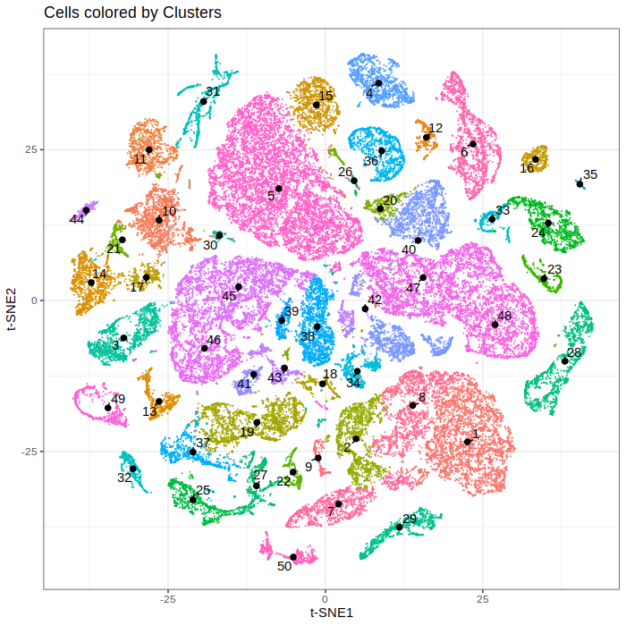
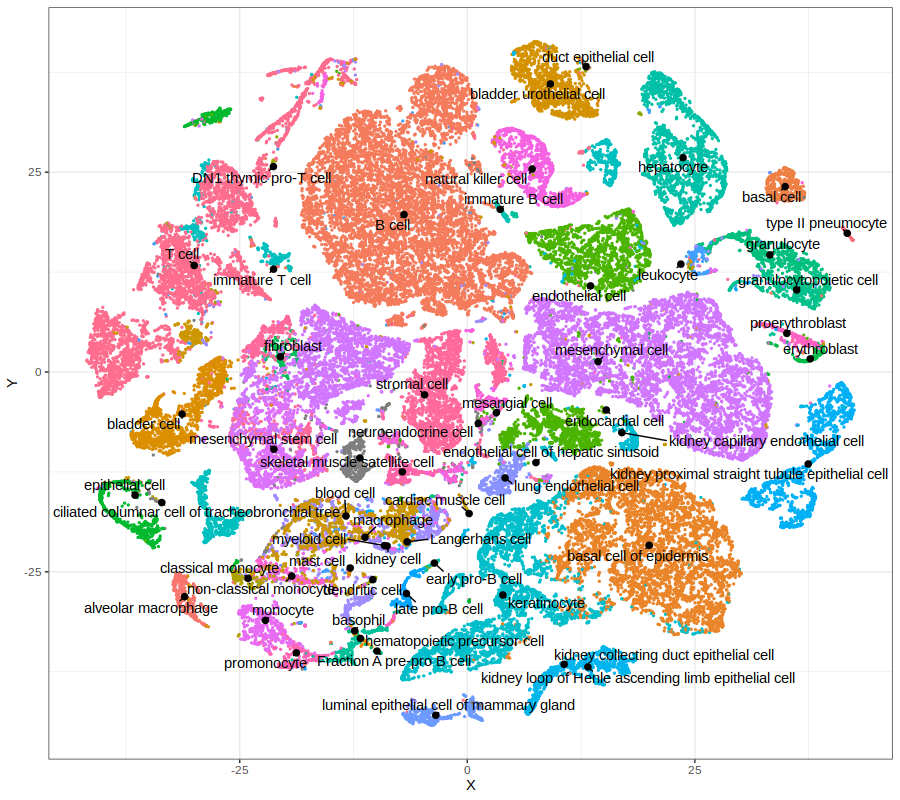

# gficf

An R implementation of the 
[Gene Frequency - Inverse Cell Frequency](https://link.to.the.paper.com) 
method for single cell data normalization (Gambardella et al. 2019), that also 
supports [Phenograph](https://www.cell.com/cell/fulltext/S0092-8674(15)00637-6)
[Louvain method](https://sites.google.com/site/findcommunities/)
clustering using [RcppAnnoy](https://cran.r-project.org/package=RcppAnnoy) library
from [uwot](https://github.com/jlmelville/uwot).
The package also support data reduction with either Principal Component Analisys (PCA) or
Latent Semantic Anlisys (LSA) before to apply t-SNE or UMAP for single cell data visualization.

## News

*July 3 2019*. First commit and documentation draft. 


## Installing

### From github

`gficf` makes use of annoy library in `uwot`. So you may have to carry out
a few extra steps before being able to build this package like for `uwot` installation:

**Windows**: install 
[Rtools](https://cran.r-project.org/bin/windows/Rtools/) and ensure 
`C:\Rtools\bin` is on your path.

**Mac OS X**: using a custom `~/.R/Makevars` 
[may cause linking errors](https://github.com/jlmelville/uwot/issues/1).
This sort of thing is a potential problem on all platforms but seems to bite
Mac owners more.
[The R for Mac OS X FAQ](https://cran.r-project.org/bin/macosx/RMacOSX-FAQ.html#Installation-of-source-packages)
may be helpful here to work out what you can get away with. To be on the safe
side, I would advise building `uwot` without a custom `Makevars`.

```R
if(!require(devtools)){
  install.packages("devtools") # If not already installed
}
devtools::install_github("dibbelab/gficf")
```

## Example
Download Tabula Muris dataset from [HERE](https://drive.google.com/open?id=1yX8IQ7DiWG8PCmYieFFS7vj53Hf1OfT2) and
annotation from [HERE](https://drive.google.com/open?id=10ixOOsqZqf6GgwQP1okwoe_TMP_ZTzn5).

```R
library(gficf)

# See function man page for help
?gficf

# Common pipeline to use that goes from normalization to clustering

# Step 1: Nomrmalize data with gficf
data = gficf::gficf(M = readRDS("path/to/TabulaMuris.10x.mouse.RAW.rds"),cell_proportion_max = 1,cell_proportion_min = .05,storeRaw = F,normalize = F)

# Step 2: Reduce data with Latent Semantic Anlysis before to apply t-SNE or UMAP
data = gficf::runLSA(data = data,dim = 50)

# Alternative Step 2: Reduce data with Principal Component Analysis before to apply t-SNE or UMAP
# data = gficf::runPCA(data = data,dim = 50)

# Step 3: Applay t-SNE on reduced data and plot cells
data = gficf::runReduction(data = data,reduction = "tsne",seed = 0,nt=4)
gficf::plotCells(data = data)

# Alternative Step 3: Applay UMAP on reduced data
# data = gficf::runReduction(data = data,reduction = "umap",seed = 0,nt=4)
# gficf::plotCells(data = data)

# Step 4: Cell clustering using Phenograph approach
data = gficf::clustcells(data = data,from.embedded = F,dist.method = "manhattan",nt = 4,k = 50,community.algo = "louvian",seed = 0)

# Step 5: Visualize cells by identified clusters
gficf::plotCells(data = data,colorBy="cluster") + xlab("t-SNE1") + ylab("t-SNE2") + ggtitle("Cells colored by Clusters") 

```

 

```R
# Additional steps: add annotation to cells and plot it.
info = readRDS("/path/to/TabulaMuris.10x.mouse.annotation.rds")
data$embedded$tissue = info$tissue
data$embedded$subtissue = info$subtissue
data$embedded$cell_ontology_class = info$cell_ontology_class
gficf::plotCells(data = data,colorBy="cell_ontology_class")

```
 


## Phenograph Implementation Details
In the package `gficf` the function `clustcells` implement the [Phenograph](https://www.cell.com/cell/fulltext/S0092-8674(15)00637-6) algorithm,
which is a clustering method designed for high-dimensional single-cell data analysis. It works by creating a graph ("network") representing phenotypic similarities between cells by calclating the Jaccard coefficient between nearest-neighbor sets, and then identifying communities using the well known [Louvain method](https://sites.google.com/site/findcommunities/) in this graph. 

In this particular implementation of Phenograph we use approximate nearest neighbors found using [RcppAnnoy](https://cran.r-project.org/package=RcppAnnoy)
libraries present in the `uwot` package. The supported distance metrics for KNN (set by the `dist.method` parameter) are:

* Euclidean (default)
* Cosine
* Manhattan
* Hamming

Please note that the Hamming support is a lot slower than the
other metrics. It is not recomadded to use it if you have more than a few hundred
features, and even then expect it to take several minutes during the index 
building phase in situations where the Euclidean metric would take only a few
seconds.

After computation of Jaccard distances among cells, the Louvain community detection is instead performed using `igraph` implementation.
All supported communities detection algorithm (set by the `community.algo` parameter) are:

* Louvain (default)
* Walktrap
* Fastgreedy

## Useful Information

* Apart from the man pages in R you may be interested in the following readings:

* A [description of t-SNE](https://lvdmaaten.github.io/tsne/).

* A [description of UMAP](https://jlmelville.github.io/uwot/umap-for-tsne.html)
using algorithmic terminology similar to t-SNE, rather than the more topological
approach of the UMAP publication.

* Some [Examples](https://jlmelville.github.io/uwot/umap-examples.html) of the 
output of UMAP on some datasets, compared to t-SNE. 

* Some results of running 
[UMAP on the simple datasets](https://jlmelville.github.io/uwot/umap-simple.html) 
from [How to Use t-SNE Effectively](https://distill.pub/2016/misread-tsne/).

